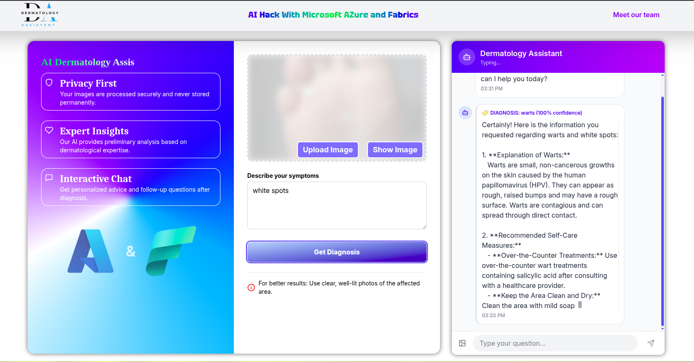
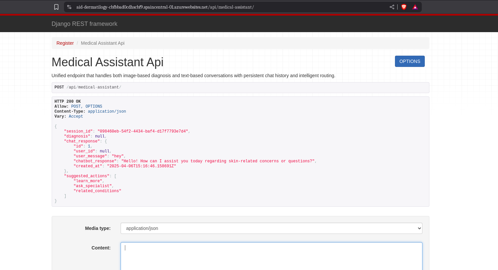
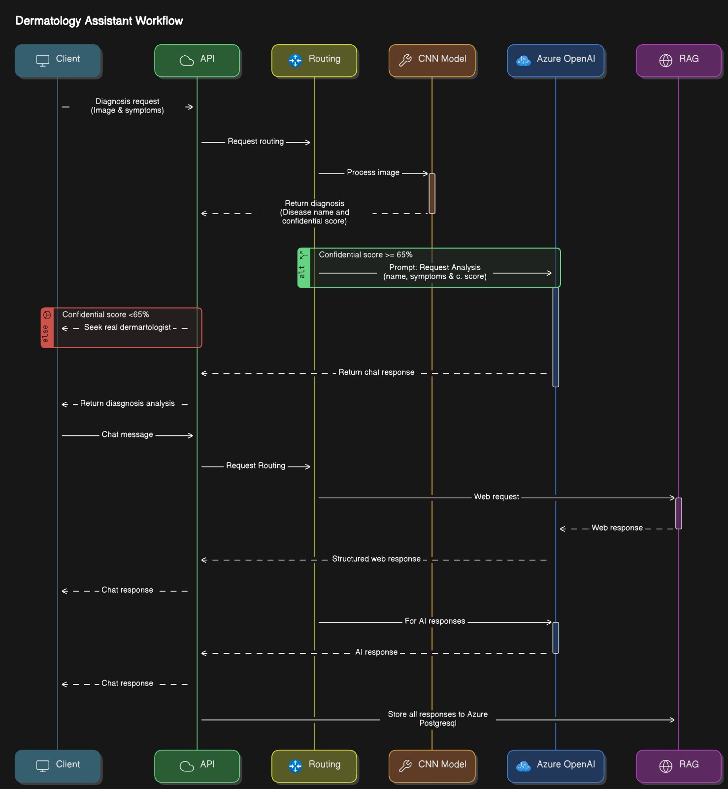
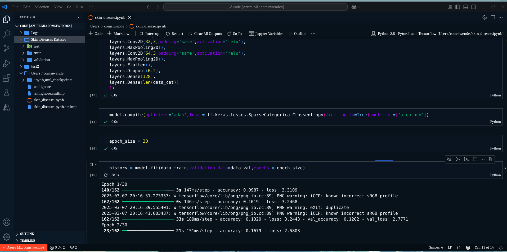
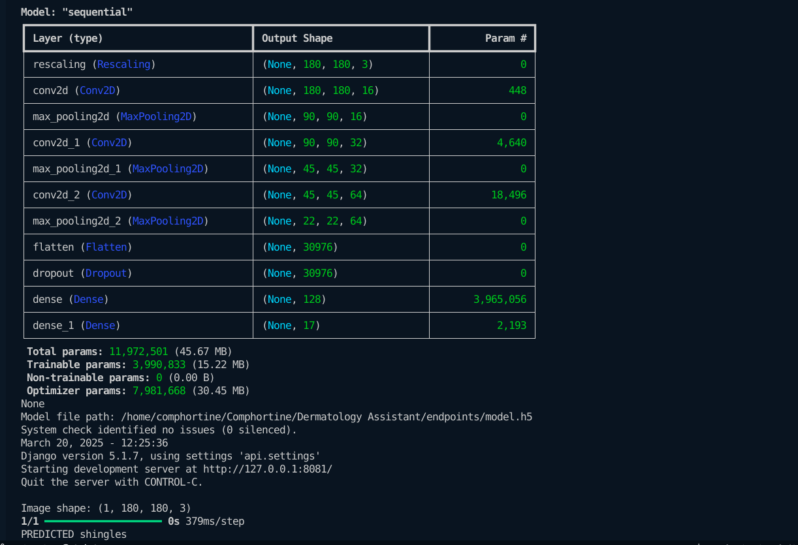
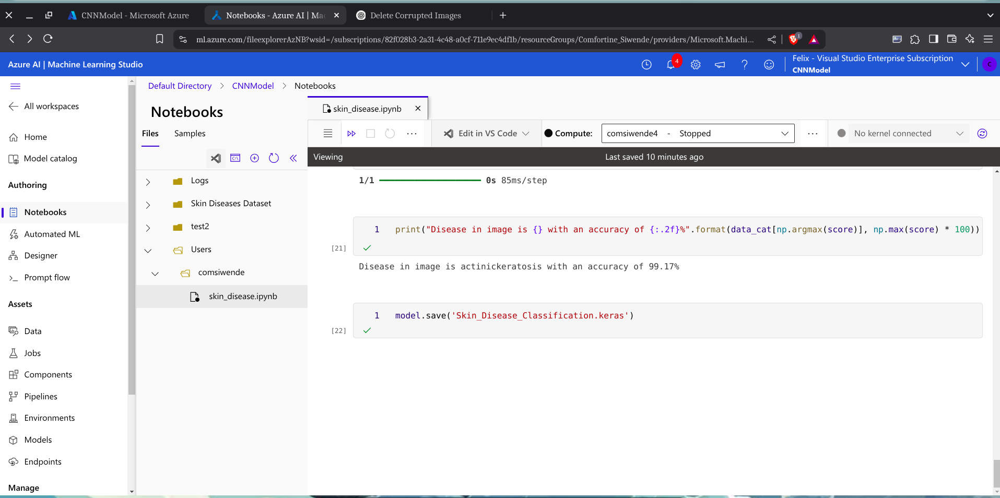

# 🤖 Agentic AI in Dermatological Care

Our project is an Agentic AI application that leverages a Generalized Convolution Neural network(CNN)-based deep learning model to classify skin diseases and integrates Azure OpenAI GPT model with LangChain and Azure AI Search to generate intelligent, context-aware dermatological healthcare recommendations.It is Designed to empower users with early self-diagnosis of skin disorders and with options for users to connect with Dermatologist (Human in the Loop), the platform combines AI-driven accuracy with actionable insights for better health outcomes. The backend, built with Django REST Framework, ensures robust API orchestration, while the React.js frontend delivers an intuitive user experience.  The entire solution—spanning AI/ML workflows, data pipelines, and the web application—is securely deployed on Azure, ensuring end-to-end scalability and integration.

## 🖥️ UI/UX of the aplication

- Our intuitive React-based web application, deployed on Azure App Services, empowers users to take control of their skin health through AI-driven diagnosis. Users can simply upload or drag-and-drop images of affected skin areas, describe their symptoms, and click "Get Diagnosis" to receive instant analysis. or Connect with Doctors for further Diagnosis

- The application leverages a CNN model for accurate image classification and integrates Azure OpenAI GPT model to provide conversational, evidence-based insights—enabling users to ask follow-up questions for deeper clarity. Every interaction is preserved, ensuring seamless continuity in symptom tracking and healthcare guidance.

- Designed for accessibility and early detection, this tool bridges the gap between users and proactive skin care, transforming how people approach dermatological health—one smart diagnosis at a time.

#### 🔗 UI/UX link

[https://www.dermartology@nestlink.org](https://purple-river-00fd8ef0f.6.azurestaticapps.net/)



### 🔌 Unified AI Medical Assistant Endpoint (/api/medical-assistant)

- The /api/medical-assistant endpoint serves as a unified interface for both image-based skin disease diagnosis and AI-powered medical conversations. When receiving an image, it processes it through a CNN model for classification and confidence scoring, while text inputs engage Azure OpenAI GPT model and LangChain—augmented by Azure AI Search—to deliver contextual, evidence-based healthcare responses. The system intelligently routes requests based on input type and maintains persistent chat history in Azure PostgreSQL, enabling seamless continuity across sessions. Designed for efficiency,the endpoint integrates with Azure API Management for scalability and security, allowing users to transition effortlessly between uploading skin condition photos and asking follow-up questions—all within a single, cohesive interaction flow.
### Key Functionalities
- Skin Image Processing and disease classification
- Context-aware chat response
- medical information retrieval
- Dermatologist Search
- Session management
- Error handling and validation

#### 🔗 endpoint link

[https://endpoint@nestlink.org](https://aid-dermatilogy-cbfbbad0cdhscbf9.spaincentral-01.azurewebsites.net/api/medical-assistant/)



# Steps on How to Clone And Run the Project

### 1. Clonning the project

```bash
 git clone https://github.com/COMFORTINE-SIWENDE/AI-Powered-Dermatology-Assistant.git
```

### 2. Navigate to root dir, Create a new virtual environment and activate it

- **In linux distribution**

```bash
python3 -m venv venv
cd venv
Source venv/bin/activate
pip install -r requirements.txt
```

- **In Window os**

```bash
python -m venv venv
cd venv
\Scripts\activate
pip install -r requirements.txt
```

- **create migrations and migrate**

```bash
python manage.py makemigrations assistant
```

```bash
python manage.py migrate
```

- **Run React App in new terminal**

```bash
cd client
npm run dev
```

- Create a .env file within the endpoints dir and provide the following(shoul not be strings).For the database you can configure sqlite3 which is by default in django.
- Modify your dabase settings to use your preferred database in settings.py

```bash
AZURE_OPENAI_API_KEY=xxxx........
AZURE_OPENAI_API_ENDPOINT=xxxx........
AZURE_OPENAI_API_VERSION=.............
AZURE_AI_SEARCH_KEY=xxxx.......
AZURE_AI_SEARCH_ENDPOINT=xxxx....
DATABASE_PASSWORD=your_db_password
```

- **Run the Django api endpoints in another terminal**

```bash
cd endpoints
python manage.py runserver 8000
```

# 🧭 Project Workflow

## 🪄 The Autonomous Agentic System Design



# 🔄 Routing

- The application employs dynamic routing to seamlessly process both image-based diagnoses and text-based medical conversations through a single, unified API endpoint (/api/medical-assistant). When a request is received, the system automatically detects the input type—whether it’s an uploaded skin photo or a text query describing symptoms—and intelligently routes it to the appropriate AI model. Image inputs are analyzed by a CNN-based classifier, which generates a diagnosis along with confidence scores, while text inputs are processed by Azure OpenAI (GPT-4 Turbo) enhanced with LangChain and Azure AI Search to deliver accurate, context-aware medical responses. This streamlined approach ensures users can effortlessly transition between submitting visual diagnostics and asking follow-up questions, all within a single, intuitive interaction flow.

# ⛓️ Prompt Chaining

- **Contextual follow-up**:If the user asks a follow-up question (e.g., "How to treat this?"), the system chains prompts by:

      Retrieving the prior diagnosis from chat history (Azure PostgreSQL).

  Injecting it into a new GPT-35 Turbo prompt:
  "The user has psoriasis (92% confidence). Provide a concise treatment plan using data from Azure AI Search, including topical treatments and lifestyle advice."

- **Multi-modal integration**:For complex queries (e.g., "Is this contagious?"), the system combines:Image analysis results (from CNN), Medical guidelines (from Azure AI Search) and Conversational context (from chat history)
  .

  Example chained prompt:
  "Based on the user's psoriasis diagnosis (image-attached), explain contagion risks and prevention steps. Cite dermatology guidelines."

# 🧠 Retrieval-Augmented Generation

**RAG (Retrieval-Augmented Generation)** enhances the AI’s responses by grounding them in up-to-date, authoritative medical knowledge—combining the reasoning of **Azure OpenAI (GPT-35 Turbo)** with targeted data retrieval from **Azure AI Search**.

---

## ⚙️ How It Works

### Knowledge Retrieval

**Medical Corpus:**  
Azure AI Search indexes trusted sources such as clinical guidelines, research papers, or drug databases.

**Contextual Queries:**  
When a user asks, _"What’s the first-line treatment for psoriasis?"_, LangChain:

- Converts the question into a search query.
- Fetches relevant excerpts (e.g., _"Topical corticosteroids are preferred for mild psoriasis..."_).

---

RAG transforms the AI from a chatbot into a **context-aware medical assistant**—bridging the gap between LLMs and clinical expertise.

Need details on fine-tuning retrievers or handling ambiguous queries?

### Project Tools,Frameworks,Technologies and Libraries

- Azure Machine Learning Compute
- Azure AI Search
- Azure OpenAI(GPT-35 turbo model)
- Langchain
- Tensorflow
- Django REST
- ReactJs
- PostgreSQL
- PowerBI
- One Lake
- Fabrics Warehouse
- Fabrics Data Factory

# 🧠 Convolution Neural Network

#### CNN Model Training with Azure Machine Learning Studio & VS Code Integration

- To develop our skin disease classifier, we designed a Sequential CNN with 3 convolutional blocks (Conv2D + MaxPooling2D), totaling 11 layers, and trained it using Azure Machine Learning Studio’s GPU clusters, orchestrated via VS Code on a local desktop. Here’s a breakdown of the process:

## Model Architecture & Specifications

### 📥 Input

- **Shape**: `(180x180x3)` RGB images
- **Preprocessing**: Standardized for consistency across all inputs

### 🧱 Convolutional Blocks

- **Structure**: 3 sequential blocks, each containing:
  - `Conv2D` layer with ReLU activation
  - `MaxPooling2D` layer for downsampling
- **Purpose**: Hierarchical feature extraction from input images

### 📤 Output Layer

- **Type**: Dense (fully-connected)
- **Neurons**: 17 (one for each skin condition class)
- **Parameters**: 2,193 trainable parameters

## 📊 Model Summary

| 🧮 Metric                | 📈 Value        |
| ------------------------ | --------------- |
| 🔢 Total Parameters      | 11.97 million   |
| 🧱 Model Weights Size    | 45.67 MB        |
| ⚙️ Optimizer States Size | 30.45 MB (Adam) |



## Training Infrastructure

### Azure ML Studio GPU Clusters

- **VM Type**: NC-series (NC6s_v3)
- **GPU**: NVIDIA Tesla V100
- **Features**:
  - Automated job scheduling
  - Hyperparameter tracking (learning rate, batch size)
  - Metric logging (accuracy, loss)

### VS Code Integration

- Connected local VS Code to Azure ML via the Azure Machine Learning Extension.

- Developed/trained the model interactively using Jupyter Notebooks(
  skin_disease.ipynb
  )

```bash
endpoint/skin_disease.ipynb
```

### The CNN model summary and testing



### Saving the generalized CNN Model



- 📊 **Total Parameters**: 11.97m
- ✅ **Memory footprint**: - model weight:45.67 MB - optimizer States:30.45


- **Source:** Connected to the REST API endpoint.
- **Destination:** Configured to route data to the `dma_lakehouse`.
- **Transformation:** Utilized Eventstream's capabilities to filter and transform incoming data before storage in lakehouse delta tables


## In End, its all about Shared responsibilities between Doctors and Agentic AI as this increases coroboration. We don't believe in **AI replacing jobs!!!**
