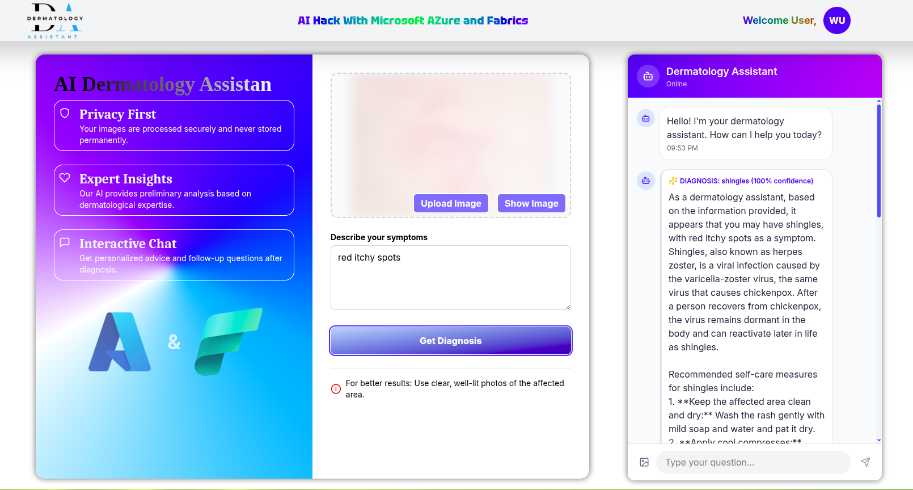

# AI-Powered-Dermatology-Assistant

This is an Agentic AI application that uses a CNN model for skin disease classification and provides healthcare recommendations using LangChain,Azure AI search and Azure OpenAI (GPT-4 Turbo) model to help users to self diagnose their skin disorder for better health care diagosis and early disease detection. Built with Django REST Framework, ReactJs Library, and PostgreSQL for seamless interaction and data management."

## UI/UX of the aplication

#### Application UI/UX link

[https://www.dermartology@nestlink.org](https://purple-river-00fd8ef0f.6.azurestaticapps.net/)


#### Application endpoint link

[https://endpoint@nestlink.org](https://aid-dermatilogy-cbfbbad0cdhscbf9.spaincentral-01.azurewebsites.net/api/medical-assistant/)


## Steps on How to Clone And Run the Project

#### 1. Clonning the project

```bash
 git clone https://github.com/COMFORTINE-SIWENDE/AI-Powered-Dermatology-Assistant.git
```

#### 2. Create a new virtual environment and activate it. In This case root dir(dirmatology assistant)

- In linux distribution

```bash
python3 -m venv venv
. ./venv/bin/activate
pip install -r requirements.txt
```

- In Window os

```bash
python -m venv venv
venv\Scripts\activate
pip install -r requirements.txt
```

- Run the Django api endpoints
- create migrations

```bash
python manage.py makemigrations
```

```bash
cd endpoints
python manage.py runserver
```

- Run React App

```bash
cd client
npm run dev
```

- Create a .env file within the endpoints dir and provide the following(shoul not be strings).For the database you can configure sqlite3 which is by default in django

```bash
AZURE_OPENAI_API_KEY=xxxx........
AZURE_OPENAI_API_ENDPOINT=xxxx........
AZURE_OPENAI_API_VERSION=.............
AZURE_AI_SEARCH_KEY=xxxx.......
AZURE_AI_SEARCH_ENDPOINT=xxxx....
DATABASE_PASSWORD=db_password
```

# Project Workflow

## The Autonomous Agentic System


- Routing
- Prompt Chaining
- Retrieval Augmented Generation (RAG)

### Project Tools,Frameworks and Libraries

- Azure Machine Learning Compute
- Azure AI Search
- Azure OpenAI(GPT-4 model)
- Langchain
- Tensorflow
- Django REST
- ReactJs
- PostgreSQL
- PowerBI
- One Lake
- SQL Notebooks

## 1.Trained Convolution Neural Network with Azure ML Compute and GPU's


#### Connecting Azure ML Studio with Vs Code


#### Saving the generalized CNN Model


#### Skin Disease Classification Model Summary

### Model Architecture

| Type           | Layers                                        | Depth           |
| -------------- | --------------------------------------------- | --------------- |
| Sequential CNN | 3 convolutional blocks(Conv2D + Maxpooling2D) | 11 layers total |

### Model key Specifications

| Layer Type  | Output shape | Parameters              |
| ----------- | ------------ | ----------------------- |
| Input       | (180x180x3)  | RGB Images              |
| Final Dense | 17 neurons   | 2193 params(outerlayer) |

### Parameter statistics

- 📊 **Total Parameters**: 11.97m
- 📈 **Trend**:
- ✅ **Memory footprint**: - model weight:45.67 MB - optimizer States:30.45
- 📅 **Next Review**:
  

## Fabrics

### 1. SQL Notebooks

### 2. OneLake

### 3. PowerBI Analytics
