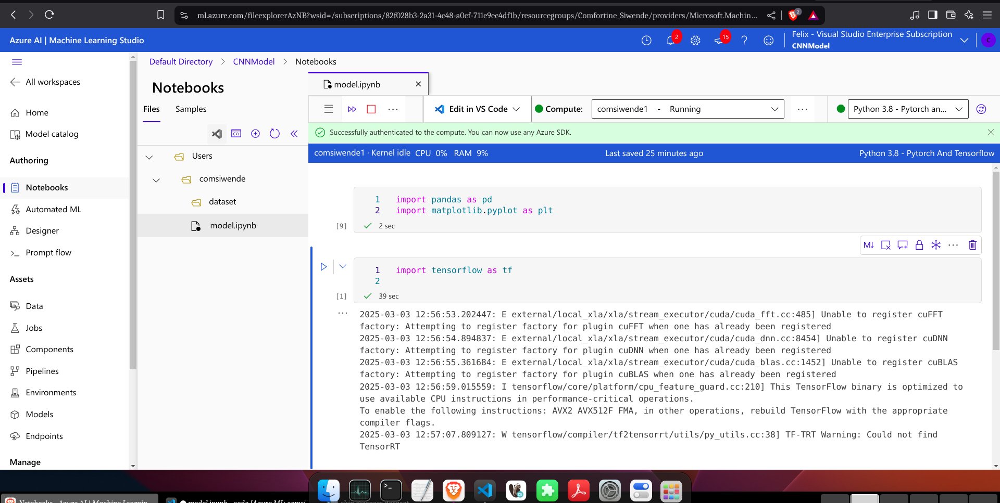

# AI-Powered-Dermatology-Assistant
This is an Agentic AI application that uses a CNN model for skin disease classification and provides healthcare recommendations using LangChain,Azure AI search and Azure OpenAI (GPT-4 Turbo) model. Built with Django REST Framework, ReactJs Library, and MariaDB for seamless interaction and data management."
## Steps on How to Clone And Run the Project
# Project Workflow
### Project Tools,Frameworks and Libraries
-Azure Machine Learning Compute
-Azure AI Search
-Azure OpenAI(GPT-4 model)
-Langchain
-Tensorflow
-Django REST 
-ReactJs
-MariaDB
## 1.Training Convolution Neural Network with Azure ML Compute

#### Connecting Azure ML Studio with Vs Code

#### Saving the generalized CNN Model

#### Skin Disease Classification Model Summary

## 2.Setting Development Environment
## 3.Autonomous Chatbot AI Agent
#### Integrating AzureOpenAI,Azure AI Search to Iteract with the Skin Disease Classification Model and the System.
### 3.1 Prompt Chaining
### 3.2 Retrieval Augmented Generation
### 3.3 Routing
### Parallelization

